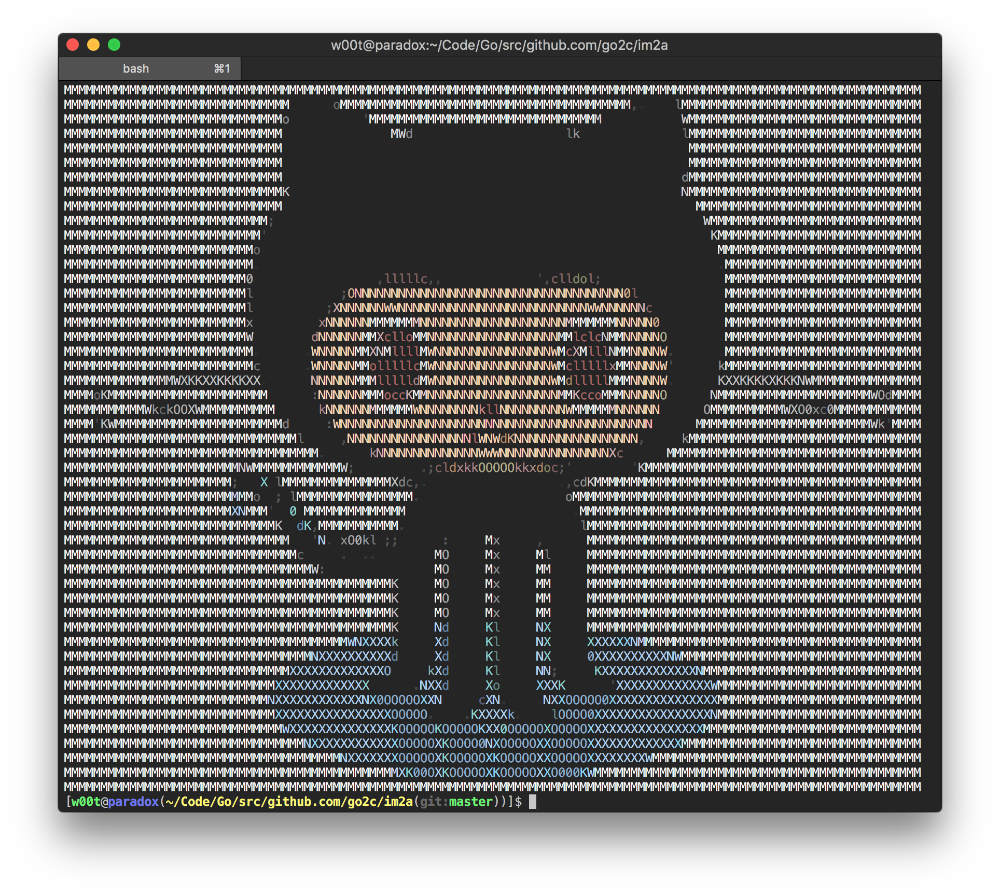
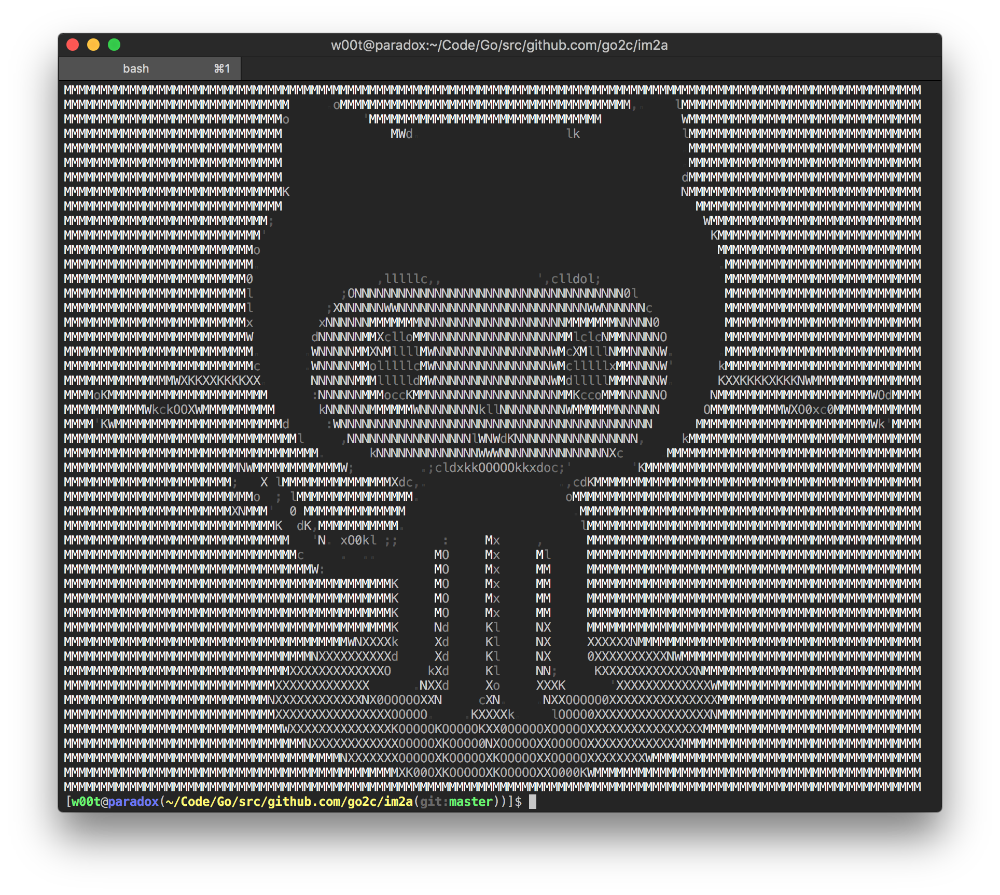
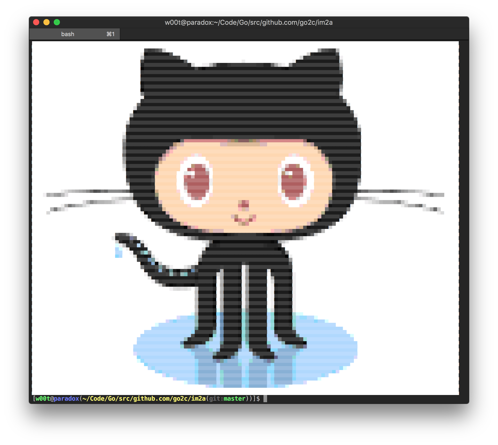
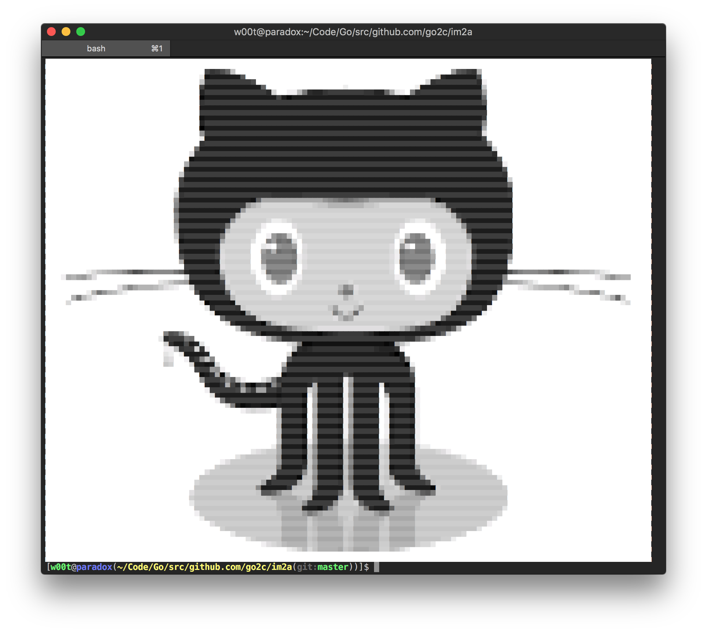

# The Go port of [im2a](https://github.com/tzvetkoff/im2a)

An image to ASCII converter, made for 256-color terminals.

Here are some examples:

| Source                      | Default                      | Grayscale                    | Pixel                        | Grayscale + Pixel            |
| --------------------------- | ---------------------------- | ---------------------------- | ---------------------------- | ---------------------------- |
|  |  |  |  |  |

## Differences from the C++ version

- It's written entirely in Go and does not depend on ImageMagick
- It only supports PNG, JPG & GIF images
- It's ~5x slower
- It handles transparency differently (e.g. rgba(255, 255, 255, 0.5) is represented like rgba(127, 127, 127, 0.5))

## Installation

``` bash
go get -u github.com/go2c/im2a
```

## Usage

```
im2a 0.6.0

Convert image files to ASCII art
Copyright (C) 2013-2017 Latchezar Tzvetkoff
Distributed under The Beerware License

Usage:
  im2a [options] [arguments]

Common options:
  -h, --help                        Print help and exit
  -v, --version                     Print version and exit

Specific options:
  -i, --invert                      Invert the image
  -t, --center                      Center the image
  -g, --grayscale                   Grayscale output
  -m, --html                        HTML mode
  -p, --pixel                       Pixel mode
  -T, --transparent                 Enable transparency
  -X, --transparency-threshold=X    Set transparency threshold (default: 1.0)
  -W, --width=N                     Set output width
  -H, --height=N                    Set output height
  -c, --charset=C                   Set output charset
  -R, --red-weight=RW               Set red component weight (default: 0.2989)
  -G, --green-weight=GW             Set green component weight (default: 0.5866)
  -B, --blue-weight=BW              Set blue component weight (default: 0.1145)
```

## License

```
----------------------------------------------------------------------------
"THE BEER-WARE LICENSE" (Revision 42):
<Latchezar Tzvetkoff> wrote this file. As long as you retain this notice you
can do whatever you want with this stuff. If we meet some day, and you think
this stuff is worth it, you can buy me a beer in return. Latchezar Tzvetkoff
----------------------------------------------------------------------------
```
